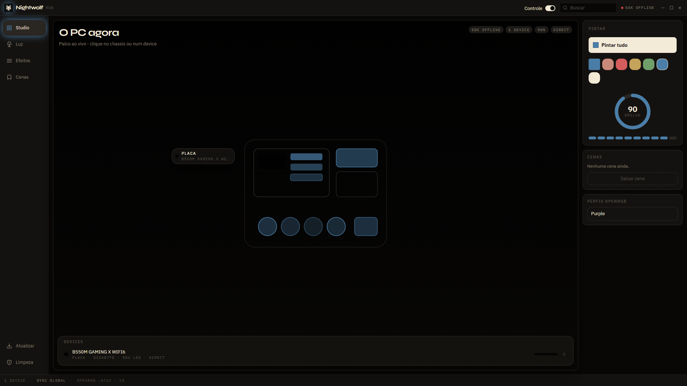
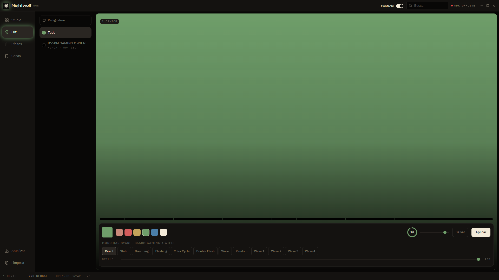
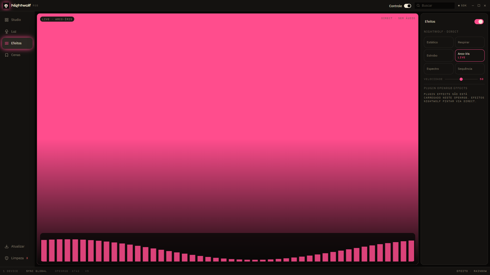
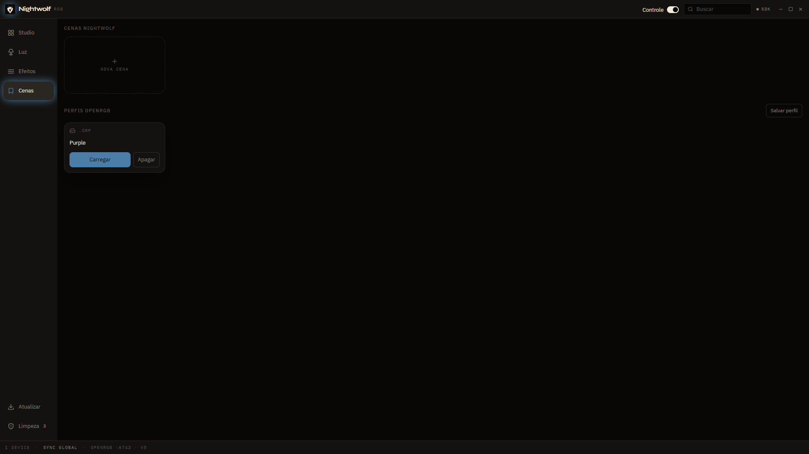

# 🐺 Nightwolf RGB - Professional RGB Control Software

<div align="center">

**The Ultimate RGB Control Interface for OpenRGB**

[](https://opensource.org/licenses/MIT)
[](https://nodejs.org/)
[](https://reactjs.org/)
[](https://openrgb.org/)

[Features](#-features) • [OpenRGB](#-openrgb) • [Quick Start](#-quick-start) • [Documentation](#-documentation) • [Screenshots](#-screenshots) • [License](#-license)

</div>

---

## 🎯 Overview

**Nightwolf RGB** is a desktop RGB control app for Windows. **OpenRGB is the engine** — Nightwolf is 100% compatible and **bundles OpenRGB**. Paint your PC's lighting without iCUE, Armoury Crate, or a manufacturer account.

### Why Nightwolf RGB?

- **🎨 Premium UI**: Stunning, futuristic design that makes RGB control a visual experience
- **⚡ Real-time Control**: Instant hardware response via WebSocket communication
- **🧹 RGB Cleanup**: Exclusive feature to eliminate conflicting RGB software
- **💾 Profile System**: Save and restore complex lighting configurations
- **🔄 Universal Sync**: Synchronize all RGB components of your PC simultaneously*
- **🌐 Web-based**: Access from anywhere on your local network
- **🆓 Open Source**: Free, transparent, and community-driven

**\*What are "devices"?** In OpenRGB/Nightwolf context, "devices" means the individual RGB components connected to **your PC**, such as:
- **Motherboard RGB headers:**
  - **ARGB** (Addressable RGB / 5V / 3-pin) - Individual LED control
  - **RGB** (Non-addressable / 12V / 4-pin) - All LEDs same color
- **RAM modules** (DDR4/DDR5 with RGB/ARGB)
- **Graphics card** RGB lighting
- **AIO liquid coolers** (pump + radiator fans with ARGB/RGB)
- **Case fans** (ARGB or RGB)
- **LED strips** (Addressable or Non-addressable)
- **RGB controllers** (Corsair Commander, NZXT Hue, etc.)
- **Some RGB peripherals** (keyboards, mice - if supported by OpenRGB)

**ARGB vs RGB Support:**
✅ **ARGB (Addressable):** Full support - control each LED individually  
✅ **RGB (Non-addressable):** Full support - all LEDs change to same color  

**Example:** Your gaming PC might have 5 "devices": Z790 Motherboard (ARGB header), Corsair RAM (ARGB - 4 sticks = 1 device), NZXT AIO Cooler (ARGB), GPU (RGB), and LED Strip (ARGB). Nightwolf RGB can control all 5 simultaneously with one click.

---

## ✨ Features

### Core Functionality
- ✅ **Device Discovery**: Automatic detection of all OpenRGB-compatible RGB components in your PC
- ✅ **Color Control**: Hex color picker with 10 preset palettes
- ✅ **Brightness Control**: Master illumination slider (0-100%)
- ✅ **Global Sync**: Apply same color to all RGB components at once (motherboard, RAM, fans, etc.)
- ✅ **Individual Control**: Target specific components independently (e.g., only RAM)
- ✅ **Native Modes**: Access hardware-specific lighting effects (breathing, rainbow, etc.)

### Advanced Features
- 🧹 **RGB Cleanup** (Exclusive): Automatically detect and terminate conflicting RGB software:
  
  **Corsair:**
  - iCUE, iCUE Service, Corsair Service, LLA Service
  
  **ASUS:**
  - Armoury Crate (Service + User Helper), Aura Service, Lighting Service, System Analysis
  
  **Razer:**
  - Synapse, Chroma SDK, Central Service, Ingame Engine, Stream Server
  
  **MSI:**
  - Afterburner, Dragon Center, Mystic Light, MSI SDK
  
  **NZXT:**
  - CAM, CAM Service
  
  **Gigabyte:**
  - RGB Fusion, RGB Fusion 2, GCC
  
  **ASRock:**
  - Polychrome RGB, ASR Services
  
  **Others:**
  - SignalRGB, Logitech G HUB, SteelSeries GG, HyperX NGenuity, Thermaltake TT RGB Plus, Cooler Master Portal, EVGA Precision, EKWB Connect, JackNet RGB Sync
  
  **Total: 70+ processes detected**

- 💾 **Profile Management**:
  - Create snapshots of current configuration
  - Save unlimited profiles
  - One-click profile application
  - Profile metadata (created date, description)

- 🎨 **Visual Effects** (Planned):
  - Constant Aura (Static)
  - Wolf Heartbeat (Breathing)
  - Thunder Strike (Flash)
  - Sonic Reaction (Audio-reactive)

### Technical Features
- 🔌 **WebSocket Communication**: Real-time bidirectional updates
- 🔄 **Auto-reconnect**: Resilient connection handling
- 📡 **REST API**: Complete HTTP API for external integrations
- 🎯 **Type-safe**: Structured data validation
- ⚙️ **Modular Architecture**: Easy to extend and customize

---

## 🔌 OpenRGB

OpenRGB is the engine. Nightwolf is **100% compatible** and **bundles OpenRGB** — the desktop app starts it. You do not need a separate OpenRGB install for `npm run desktop`.

- SDK server typically on **port 6742**
- Current live setup: **protocol v5**
- Device identity, hardware modes, zones, per-LED, matrix, resize, segments, rescan
- Native `.orp` profiles (separate from Nightwolf scenes)
- If the Effects plugin is **already loaded** in the bundled OpenRGB, Nightwolf can start/stop it by name. There is no plugin store.

Nightwolf does **not**: install or unload plugins; expose Effects-plugin speed/audio/shaders; auto-update Nightwolf.exe over the network; speak protocol v6; capture mic or system audio via the SDK.

Links: [openrgb.org](https://openrgb.org/) · [GitLab · CalcProgrammer1/OpenRGB](https://gitlab.com/CalcProgrammer1/OpenRGB)

---

## 🚀 Quick Start

### Prerequisites

1. **Windows** (Linux/Mac support planned)
2. **Node.js** v18 or higher (clone / dev only)
3. **OpenRGB** comes in the Nightwolf bundle — `npm run desktop` starts it. You do not download it separately.

### Installation

```bash
# Clone the repository
git clone https://github.com/klebertiko/NightwolfRGB.git
cd nightwolf-rgb

# Install backend dependencies
cd backend
npm install

# Install frontend dependencies  
cd ../frontend
npm install
```

### OpenRGB (bundled)

`npm run desktop` starts the bundled OpenRGB SDK (typically port 6742). You do not need to open OpenRGB first.

If you run a standalone OpenRGB for debugging: SDK Server tab → Start Server → Online on 6742.

### Running the Application

Nightwolf RGB is a **desktop app**. From the repo root:

```bash
npm install
npm run desktop
```

That opens a native window (Electron). The backend is started by the app; Vite is used only as the renderer in development.

To elevate on Windows (needed for OpenRGB + RGB cleanup services):

```powershell
.\start-dev-admin.ps1
```

Browser at `http://localhost:5173` is a fallback for layout work, not the product.

---

## 📖 Documentation

### API Endpoints

#### Status & Connection
```http
GET /api/status
```
Returns connection status and device count.

#### Devices
```http
GET    /api/devices              # List all devices
GET    /api/devices/:id          # Get specific device
POST   /api/devices/:id/color    # Set device color
POST   /api/devices/:id/mode     # Change device mode
POST   /api/devices/:id/brightness  # Adjust brightness
POST   /api/devices/sync         # Sync all devices
```

#### Profiles
```http
GET    /api/profiles             # List profiles
POST   /api/profiles             # Create profile
POST   /api/profiles/snapshot    # Snapshot current state
POST   /api/profiles/:id/apply   # Apply profile
DELETE /api/profiles/:id         # Delete profile
```

#### RGB Cleanup (Windows Only)
```http
GET    /api/cleanup/status       # Get cleanup status
GET    /api/cleanup/detect       # Detect conflicts
POST   /api/cleanup/kill-processes   # Kill RGB processes
POST   /api/cleanup/disable-services # Stop RGB services
POST   /api/cleanup/full         # Complete cleanup
```

### Frontend Hooks

```javascript
// WebSocket connection
const { connected, deviceCount, status } = useOpenRGB();

// Device management
const { devices, loading, setColor, setMode, setBrightness, syncAll } = useDevices();

// Profile management
const { profiles, createProfile, applyProfile, deleteProfile } = useProfiles();

// RGB Cleanup
const { status, detectConflicts, fullCleanup } = useCleanup();
```

---

## 🎨 Screenshots

Captures from the desktop app (`npm run desktop`) on 8 Sep 2026 — 1 device, B550M GAMING X WIFI6. Landing: [klebertiko.github.io/NightwolfRGB](https://klebertiko.github.io/NightwolfRGB/).

### Studio


### Luz


### Efeitos


### Cenas


---

## 🏗️ Architecture

```
┌─────────────────┐      HTTP/WS      ┌──────────────────┐
│  React Frontend │◄─────────────────►│ Express Backend  │
│   (Port 5173)   │                   │   (Port 3001)    │
└─────────────────┘                   └─────────┬────────┘
                                                │ OpenRGB
                                                │ SDK Protocol
                                                │ TCP:6742
                                        ┌───────▼────────┐
                                        │  OpenRGB SDK   │
                                        │    Server      │
                                        └───────┬────────┘
                                                │ USB/I2C/SMBus
                                    ┌───────────┴───────────┐
                                    │                       │
                            ┌───────▼─────┐         ┌──────▼──────┐
                            │ Motherboard │         │     RAM     │
                            │ RGB Headers │         │  (4 sticks) │
                            └─────────────┘         └─────────────┘
                                    │                       │
                        ┌───────────┼───────────┬───────────┘
                        │           │           │
                 ┌──────▼────┐ ┌───▼────┐ ┌───▼─────┐
                 │  AIO/Pump │ │  Fans  │ │   GPU   │
                 │  Cooler   │ │  RGB   │ │   RGB   │
                 └───────────┘ └────────┘ └─────────┘
                        │
                 ┌──────▼───────┐
                 │  LED Strips  │
                 │  (Addressable)│
                 └──────────────┘

      ▲ ALL components in ONE PC = "Devices"
```

**Key Points:**
- One instance of Nightwolf RGB = One PC's RGB components
- "Sync All" = Synchronize motherboard + RAM + AIO + fans + GPU + strips
- Each component can also be controlled individually

### Tech Stack

**Frontend:**
- React 18.2
- Vite (Build tool)
- Lucide React (Icons)
- Axios (HTTP client)
- WebSocket (Real-time)

**Backend:**
- Node.js Express
- openrgb-sdk 0.6.0
- WebSocket (ws library)
- File-based storage (JSON)

---

## 🛠️ Development

### Project Structure

```
nightwolf-rgb/
├── backend/
│   ├── controllers/
│   │   ├── openrgb.controller.js    # OpenRGB SDK integration
│   │   ├── profiles.controller.js   # Profile CRUD
│   │   └── cleanup.controller.js    # RGB cleanup logic
│   ├── routes/
│   │   ├── devices.routes.js
│   │   ├── profiles.routes.js
│   │   └── cleanup.routes.js
│   ├── utils/
│   │   └── color.utils.js           # Color conversions
│   ├── data/
│   │   └── profiles.json            # Saved profiles
│   └── server.js                    # Main server
└── frontend/
    ├── src/
    │   ├── components/
    │   │   ├── ConnectionStatus.jsx
    │   │   └── CleanupPanel.jsx
    │   ├── hooks/
    │   │   ├── useOpenRGB.js
    │   │   ├── useDevices.js
    │   │   ├── useProfiles.js
    │   │   └── useCleanup.js
    │   ├── api/
    │   │   └── client.js
    │   └── App.jsx                  # Main application
    └── package.json
```

### Environment Variables

**Backend (.env):**
```env
OPENRGB_HOST=localhost
OPENRGB_PORT=6742
SERVER_PORT=3001
NODE_ENV=development
```

**Frontend (.env):**
```env
VITE_API_URL=http://localhost:3001
```

---

## 🔧 Troubleshooting

### Backend won't connect to OpenRGB

**Symptoms:**  
`❌ Failed to connect to OpenRGB`

**Solutions:**
1. Ensure OpenRGB is running
2. Check SDK Server is "Online" in OpenRGB
3. Verify port 6742 is not blocked by firewall
4. Try restarting OpenRGB with `--server` flag

### Frontend shows "Disconnected"

**Symptoms:**  
Red status indicator, no devices shown

**Solutions:**
1. Verify backend is running on port 3001
2. Check browser console for WebSocket errors
3. Confirm `.env` file exists in frontend folder
4. Try hard refresh (Ctrl+Shift+R)

### Colors don't change on hardware

**Symptoms:**  
UI updates but hardware doesn't respond

**Solutions:**
1. **Close other RGB software** (iCUE, Armoury Crate, etc)
2. Use built-in **RGB Cleanup** feature
3. Set device to "Direct" mode in OpenRGB first
4. Check device permissions (may need admin rights)

### RGB Cleanup doesn't work

**Symptoms:**  
Processes still running after cleanup

**Requirements:**
- Windows only (currently)
- Run backend as Administrator for service control
- Some processes may require manual termination

---

## 🗺️ Roadmap

### v1.1 (Upcoming)
- [ ] Audio-reactive effects
- [ ] Custom effect builder
- [ ] Gradient color picker
- [ ] Per-zone control

### v1.2
- [ ] Scheduler (time-based profiles)
- [ ] Game integration hooks
- [ ] Mobile responsive design
- [ ] Dark/Light theme toggle

### v2.0
- [ ] Electron desktop app
- [ ] System tray integration
- [ ] Auto-start with Windows
- [ ] Cloud profile sync
- [ ] Community profile marketplace

---

## 🤝 Contributing

We welcome contributions! Here's how you can help:

1. **Fork** the repository
2. Create a **feature branch** (`git checkout -b feature/amazing-feature`)
3. **Commit** your changes (`git commit -m 'Add amazing feature'`)
4. **Push** to the branch (`git push origin feature/amazing-feature`)
5. Open a **Pull Request**

### Development Guidelines
- Follow existing code style
- Add comments for complex logic
- Test with real RGB hardware
- Update documentation for new features

---

## 📜 License

This project is licensed under the **MIT License** - see the [LICENSE](LICENSE) file for details.

---

## 🙏 Acknowledgments

- **OpenRGB Team** - For the amazing open-source RGB control software
- **Lucide Icons** - Beautiful icon library
- **React Community** - Excellent documentation and support
- **All Contributors** - Thank you for making this project better!

---

## ❓ FAQ (Frequently Asked Questions)

### Q: O Nightwolf RGB sendo web-based pode controlar vários PCs simultaneamente?

**R:** Não. Cada instância do Nightwolf RGB (backend + OpenRGB) controla **apenas o hardware do computador onde está instalado**.

**Como funciona:**
```
┌─────────────────────────────────────────┐
│  PC Gaming (192.168.1.100)              │
│  ┌─────────────────────────────────┐    │
│  │ OpenRGB + Nightwolf Backend     │    │
│  │ Controla: MB, RAM, GPU deste PC │    │
│  └─────────────────────────────────┘    │
└─────────────────────────────────────────┘
         ▲
         │ HTTP/WebSocket
         │ (Acesso via rede)
         │
┌────────┴──────────────────────────────┐
│  Qualquer dispositivo na rede         │
│  - Notebook, Tablet, Celular          │
│  - Acessa http://192.168.1.100:5173   │
│  - Controla o RGB do PC Gaming        │
└───────────────────────────────────────┘
```

**Benefícios do Web-based:**
- ✅ Acesse de qualquer navegador (não precisa instalar nada)
- ✅ Controle do sofá via tablet/celular
- ✅ Múltiplos usuários podem ver/controlar (desde que na mesma rede)
- ✅ Interface não depende de sistema operacional

**Para controlar múltiplos PCs:**
Você precisaria instalar Nightwolf RGB em cada PC:
- PC 1: http://192.168.1.100:5173 (controla hardware do PC 1)
- PC 2: http://192.168.1.101:5173 (controla hardware do PC 2)
- Etc.

### Q: Quantos "devices" um PC típico tem?

**R:** Depende da configuração, mas um setup gaming comum tem entre **3-8 devices**:

**Exemplo - PC Gaming Médio:**
1. **ASUS ROG STRIX Z790** (Motherboard) - 1 device
2. **Corsair Dominator Platinum 64GB** (4x16GB) - 1 device (RAM é agrupada)
3. **NZXT Kraken Z73 AIO** - 1 device
4. **QL120 RGB Fans (6x)** - 1 device (fans conectadas ao mesmo hub)
5. **NVIDIA RTX 4090** - 1 device 
6. **LED Strip Addressable** - 1 device

**Total: 6 devices** que podem ser controlados individual ou simultaneamente.

**Setup Extremo (Entusiasta):**
- Motherboard RGB
- RAM (pode ser 2 devices se canais separados)
- AIO Pump
- AIO Radiator Fans (separado do pump)
- Case Fans Intake
- Case Fans Exhaust
- GPU
- LED Strip Teto
- LED Strip Mesa
- Vertical GPU Mount RGB
- Cable Combs RGB

**Total: 11+ devices**

### Q: Preciso deixar o backend rodando sempre?

**R:** Sim, para controle em tempo real. Porém, as configurações salvas nos dispositivos (modos nativos) persistem mesmo após fechar a aplicação.

### Q: Funciona em Linux/Mac?

**R:** 
- **Backend:** Sim, Node.js é multiplataforma
- **OpenRGB:** Sim, suporta Linux e Mac
- **RGB Cleanup:** Apenas Windows (usa comandos específicos do Windows)

### Q: Por que não usar os softwares oficiais (iCUE, Armoury Crate)?

**R:**
- **Bloatware:** Softwares oficiais consomem muita RAM/CPU
- **Conflitos:** Múltiplos softwares brigam pelo controle
- **Limitações:** Cada um controla apenas sua marca
- **OpenRGB + Nightwolf:** Leve, universal, open-source, sem telemetria

### Q: É seguro matar processos do iCUE/Armoury Crate?

**R:** Sim. Os processos RGB são apenas para iluminação. Funcionalidades críticas (atualização de firmware, monitoring) não são afetadas. Você pode reiniciar os softwares depois, se necessário.

### Q: O RGB Cleanup precisa de privilégios de administrador?

**R:** 
- **Matar processos:** Não (maioria dos casos)
- **Parar serviços:** Sim (requer admin)

Execute o backend como administrador para funcionalidade completa:
```bash
# Windows (PowerShell como Admin)
cd backend
npm run dev
```

---

## 📞 Support

- **Issues**: [GitHub Issues](https://github.com/klebertiko/NightwolfRGB/issues)
- **Discussions**: [GitHub Discussions](https://github.com/klebertiko/NightwolfRGB/discussions)
- **Discord**: [Join our server](#) (Coming soon)
- **Email**: support@nightwolf-rgb.com

---

<div align="center">

**Made with ❤️ and RGB**

[⬆ Back to Top](#-nightwolf-rgb---professional-rgb-control-software)

</div>
